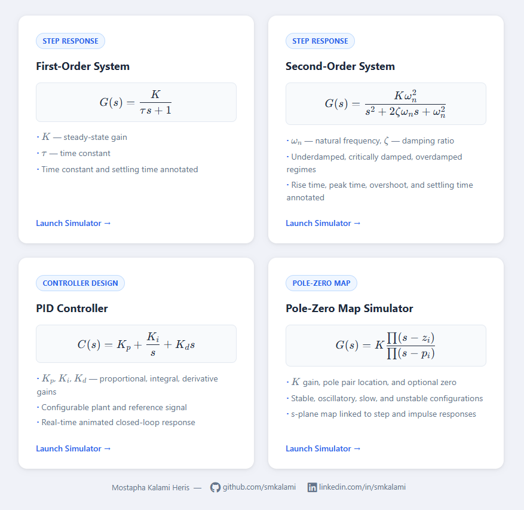
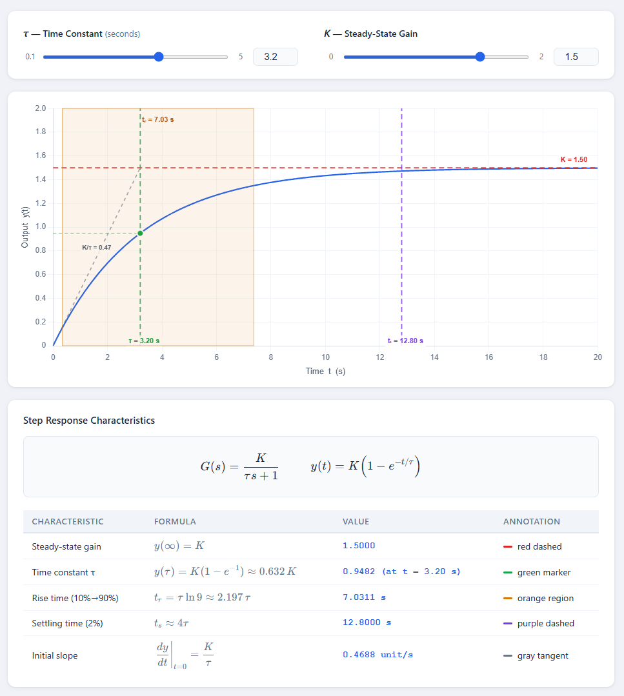
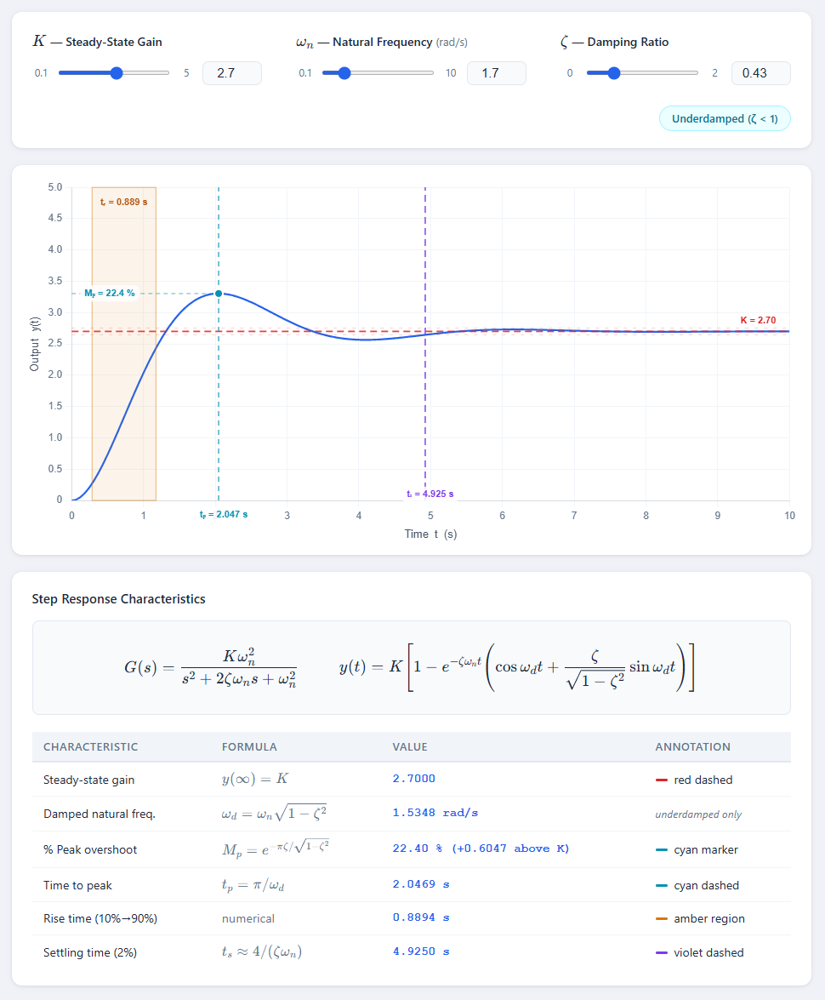
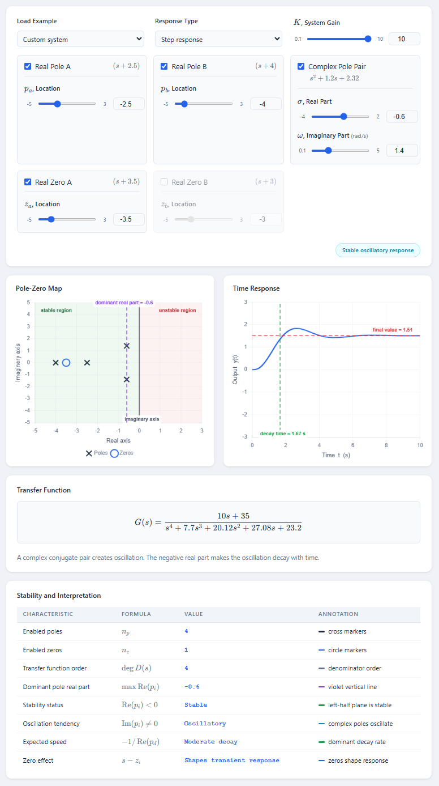
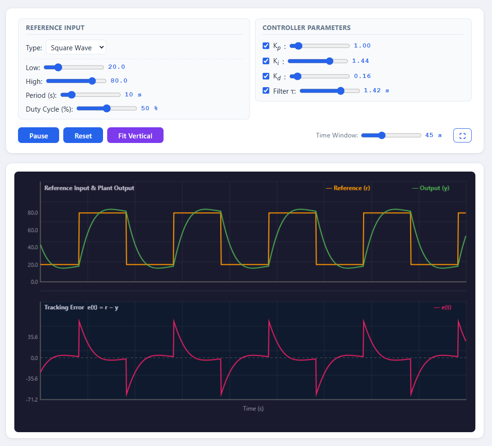

# Control System Interactive Simulators

This repository contains a collection of interactive educational simulators for control systems engineering. These web-based tools provide real-time visualization of system dynamics. They are designed to help students and professionals build an intuitive understanding of control theory concepts.

## Available Simulators

### First-Order System
This simulator visualizes the step response of a standard first-order system. Users can adjust the steady-state gain and the time constant. The plot automatically annotates the time constant and settling time to demonstrate how these parameters shape the transient response.

### Second-Order System
This tool explores the step response of a second-order system. By tuning the natural frequency and the damping ratio, users can observe the transition between underdamped, critically damped, and overdamped regimes. Important characteristics like rise time, peak time, overshoot, and settling time are annotated directly on the graph.

### Pole-Zero Map
The Pole-Zero Map simulator provides a direct link between the s-plane and time-domain behavior. Users can adjust the system gain, place a pole pair, and include an optional zero to immediately see the resulting step and impulse responses. The interactive interface makes it easy to understand stable, oscillatory, slow, and unstable configurations.

### PID Controller
This simulator focuses on closed-loop controller design. Users can configure a plant model and a reference signal, then tune the proportional, integral, and derivative gains. The real-time animated response clearly reveals the effect of each control action on tracking capability and system stability.

## Overview and Usage

To run these simulators locally, simply open the corresponding `index.html` file in a modern web browser. No specialized servers or build tools are required.

## Author

Created by Mostapha Kalami Heris.
